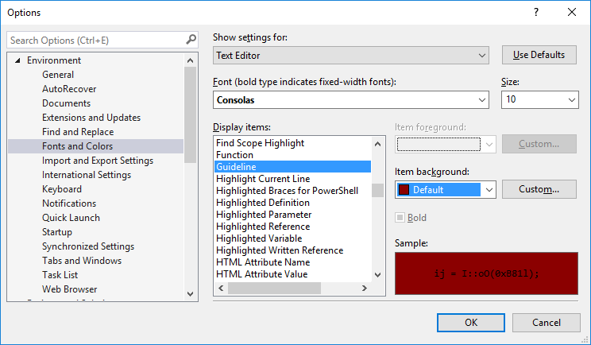

# Editor Guidelines
A Visual Studio extension that adds vertical column guides to the text editor.

[](https://marketplace.visualstudio.com/items?itemName=PaulHarrington.EditorGuidelines)
[](https://marketplace.visualstudio.com/items?itemName=PaulHarrington.EditorGuidelines)
[](https://marketplace.visualstudio.com/items?itemName=PaulHarrington.EditorGuidelines)

The extension adds vertical column guides behind your code. This is useful if you are trying to tabulate columns of data or if you want to ensure that your lines don't extend beyond a certain length. You specify where the guides go and what color they should be.

[](https://dev.azure.com/pharring/EditorGuidelines/_build/latest?definitionId=1&branchName=master)

## Getting Started
[Download](https://marketplace.visualstudio.com/items?itemName=PaulHarrington.EditorGuidelines) and run the extension (VSIX) for Visual Studio 2012 or later from the [Visual Studio Marketplace](https://marketplace.visualstudio.com/items?itemName=PaulHarrington.EditorGuidelines) or, from within Visual Studio, search for "Editor Guidelines" in the "Extensions and Updates" UI.

Control guidelines via the context (right-click) menu on the editor surface. You will see a *Guidelines* flyout with three commands:


* When *Add Guideline* is selected, a vertical dashed line will be drawn at the same position as the caret (insertion point).
* *Remove Guideline* will remove any guideline at the current insertion point.
* *Remove All Guidelines* does exactly that.

These commands may also be accessed from Visual Studio's Command Window.


Note that the column numbers used for the `Edit.AddGuideline` and `Edit.RemoveGuideline` commands refer to the right side of the given column of text.
i.e. To place a guide to the right of column 80, use `Edit.AddGuideline 80`. To place a guide to the left of the first column use `Edit.AddGuideline 0`.

You can change the guideline color from the Fonts and Colors page in `Tools|Options`. Look for *Guideline* in the Text Editor category:



## .editorconfig support (VS 2017 and VS 2019 only)
For VS 2017 and VS 2019, the position of guidelines can be overridden via settings in .editorconfig files.
Set the `guidelines` property to a list of column values. The following example sets guidelines at columns 80 and 120 for C# and VB files and a single guideline at column 80 for all other files.

```.txt
# All files
[*]
guidelines = 80

# C# or VB files
[*.{cs,vb}]
guidelines = 80, 120
```

You can also set the guideline style like this:
```.txt
[*]
guidelines_style = 1px dotted black

[*.{cs,vb}]
guidelines_style = 2px solid 40ff0000 # Red with 25% opacity
```
As shown, you can have different styles for different file types. There are three different drawing styles:
- solid
- dotted
- dashed

As the examples show, colors may be named or in RGB or ARGB (hexadecimal) format. The available color names are from WPF's Colors collection.

To learn more about .editorconfig see https://aka.ms/editorconfigdocs

**Note:** When guidelines are set via .editorconfig they override any other guidelines set via the context menus or command window.

_Note: This extension collects and transmits anonymized usage statistics to the extension author for product improvement purposes._
